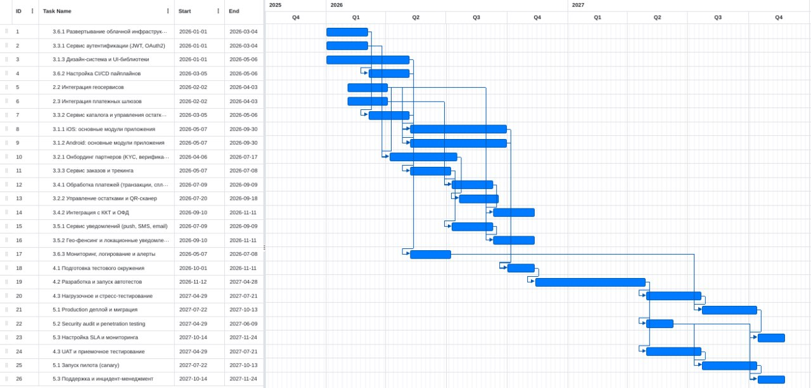

## План разработки проекта

| ID | Техническая задача | Старт | Финиш | Дл. (дн.) | Зависит от |
|----|-------------------|-------|-------|-----------|------------|
| 3.6.1 | Развертывание облачной инфраструктуры (k8s, сети, БД) | 2026-Q1 | 2026-Q1 | 45 | - |
| 3.3.1 | Реализация сервиса аутентификации (JWT, OAuth2) | 2026-Q1 | 2026-Q1 | 45 | - |
| 3.1.3 | Разработка дизайн-системы и UI-библиотек | 2026-Q1 | 2026-Q2 | 90 | - |
| 3.6.2 | Настройка CI/CD пайплайнов (сборка, тесты, деплой) | 2026-Q1 | 2026-Q2 | 45 | 3.6.1 |
| 2.2 | Интеграция геосервисов (карты, поиск, маршрутизация) | 2026-Q1 | 2026-Q2 | 45 | - |
| 2.3 | Интеграция платежных шлюзов | 2026-Q1 | 2026-Q2 | 45 | - |
| 3.3.2 | Разработка сервиса каталога и управления остатками | 2026-Q1 | 2026-Q2 | 45 | 3.3.1 |
| 3.1.1 | iOS: разработка основных модулей приложения | 2026-Q2 | 2026-Q3 | 105 | 3.1.3,2.2,2.3 |
| 3.1.2 | Android: разработка основных модулей приложения | 2026-Q2 | 2026-Q3 | 105 | 3.1.3,2.2,2.3 |
| 3.2.1 | Реализация онбординга партнеров (KYC, верификация) | 2026-Q2 | 2026-Q3 | 75 | 3.3.1,2.2 |
| 3.3.3 | Разработка сервиса заказов и трекинга | 2026-Q2 | 2026-Q3 | 45 | 3.3.2 |
| 3.4.1 | Реализация обработки платежей (транзакции, сплит) | 2026-Q3 | 2026-Q3 | 45 | 2.3,3.3.3 |
| 3.2.2 | Разработка модуля управления остатками и QR-сканера | 2026-Q3 | 2026-Q3 | 45 | 3.2.1 |
| 3.4.2 | Интеграция с ККТ и ОФД (фискализация) | 2026-Q3 | 2026-Q4 | 45 | 3.4.1 |
| 3.5.1 | Реализация сервиса уведомлений (push, SMS, email) | 2026-Q3 | 2026-Q3 | 45 | 3.3.3 |
| 3.5.2 | Разработка гео-фенсинга и локационных уведомлений | 2026-Q3 | 2026-Q4 | 45 | 2.2,3.5.1 |
| 3.6.3 | Настройка мониторинга, логирования и алертов | 2026-Q2 | 2026-Q3 | 45 | 3.6.2 |
| 4.1 | Подготовка тестового окружения и данных | 2026-Q4 | 2026-Q4 | 30 | 3.1.1,3.1.2 |
| 4.2 | Разработка и запуск автотестов (unit, integration, e2e) | 2026-Q4 | 2027-Q2 | 120 | 4.1 |
| 4.3 | Нагрузочное и стресс-тестирование | 2027-Q2 | 2027-Q3 | 60 | 4.2 |
| 5.1 | Production деплой и миграция данных | 2027-Q3 | 2027-Q4 | 60 | 4.3,3.6.3 |
| 5.2 | Security audit и penetration testing | 2027-Q2 | 2027-Q2 | 30 | 4.2 |
| 5.3 | Настройка SLA и операционного мониторинга | 2027-Q4 | 2027-Q4 | 30 | 5.1,5.2 |
| 4.3 | UAT и пользовательское приемочное тестирование | 2027-Q2 | 2027-Q3 | 60 | 4.2 |
| 5.1 | Поэтапный запуск пилота (canary, постепенное масштабирование) | 2027-Q3 | 2027-Q4 | 60 | 4.3,5.2 |
| 5.3 | Настройка процессов поддержки и инцидент-менеджмента | 2027-Q4 | 2027-Q4 | 30 | 5.1,5.2 |
