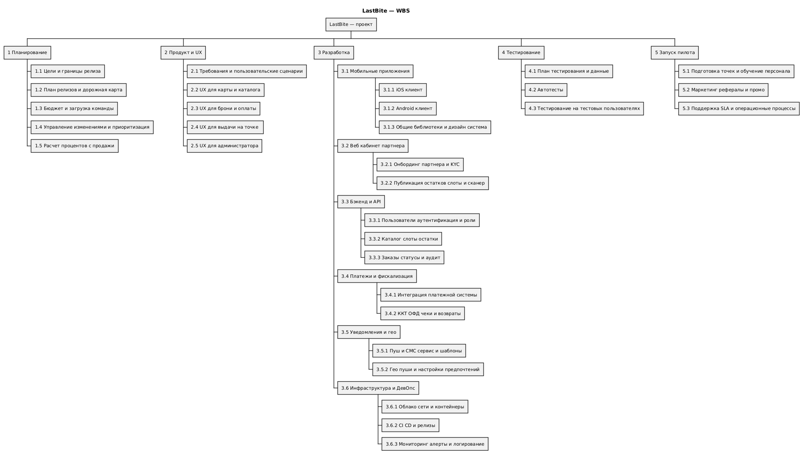
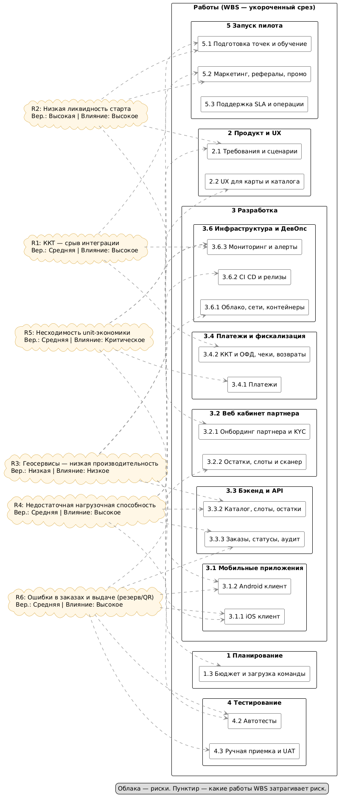

### Work Breakdown Structure 

### Риски

## Риск: Невыполнение сроков интеграции с ККТ

- **Описание**: Задержки в интеграции с кассовыми аппаратами и ОФД
- **Последствия**: Невозможность фискализации, штрафы, срыв запуска
- **Вероятность**: Средняя
- **Влияние**: Высокое
- **Меры предотвращения**: 
  - Ранний старт интеграционных работ
  - Выбор проверенных провайдеров (АТОЛ/Эвотор)
  - Параллельная разработка fallback-решения
- **Меры устранения**: 
  - Временный режим ручной фискализации
  - Приоритизация критичных интеграций

## Риск: Низкая ликвидность на старте

- **Описание**: Партнеры неохотно идут на сотрудничество или не публикуют достаточное количество боксов. Мало спроса со стороы пользователей.
- **Последствия**: Недостаток предложений для пользователей, низкая выручка, уход партнёров.
- **Вероятность**: Высокая
- **Влияние**: Высокое
- **Меры предотвращения**:
  - Упрощение интерфейса публикации
  - API интеграции с системами учета
  - Кластерный запуск, гарантированное промо партнёрам, минимальные цены.
- **Меры устранения**:
  - Ручная помощь в onboarding
  - Шаблоны и массовая загрузка
  - Денежная мотивация участникам процесса: например гарантированный выкуп части продукции на первое время

## Риск: Проблемы с производительностью геосервисов

- **Описание**: Медленная работа карт и поиска по геолокации
- **Последствия**: Плохой пользовательский опыт, отток клиентов
- **Вероятность**: Низкая
- **Влияние**: Низкое
- **Меры предотвращения**:
  - Кэширование геоданных
  - Клиентская кластеризация
  - Load testing картографических сервисов
- **Меры устранения**:
  - Упрощенный режим отображения
  - Ограничение радиуса поиска

## Риск: Недостаточная нагрузочная способность

- **Описание**: Система не выдерживает пиковые нагрузки
- **Последствия**: Отказы сервиса в часы пик
- **Вероятность**: Средняя
- **Влияние**: Высокое
- **Меры предотвращения**:
  - Автоматическое масштабирование
  - Нагрузочное тестирование
  - Кэширование на всех уровнях
- **Меры устранения**:
  - Ограничение функциональности
  - Увеличение ресурсов
  - Система мониторинга на нагрузки
  - Graceful degradation

## Риск: Несходимость unit-экономики

- **Описание**: Доходы от комиссий не покрывают операционные расходы и затраты на обработку платежей
- **Последствия**: Убыточность бизнес-модели, невозможность масштабирования, необходимость дополнительного финансирования
- **Вероятность**: Средняя
- **Влияние**: Критическое
- **Меры предотвращения**:
  - Детальный предварительный расчет unit-экономики с пессимистичным сценарием
  - Поэтапное тестирование ценностного предложения с реальными клиентами
  - Гибкая модель комиссий с возможностью оперативной корректировки
  - Регулярный мониторинг ключевых метрик (CAC, LTV, маржинальность)
- **Меры устранения**:
  - Пересмотр структуры комиссий и тарифов
  - Оптимизация операционных расходов
  - Введение дополнительных платных услуг для партнеров
  - Фокус на наиболее маржинальных сегментах и географии

## Риск: Ошибки в заказах и выдаче (логика резерва/QR)
 - **Описание**: гонки состояний, повторная выдача, потеря резерва, неверная верификация QR.
 - **Последствия**: финансовые потери, негатив партнёров/пользователей.
 - **Вероятность**: средняя
 - **Влияние**: высокое
 - **Меры предотвращения**:
    -Идемпотентные операции, транзакции/локи, аудит-лог.
    -E2E-тесты на конкуренцию, тест-кейсы выдачи/сканера.
    -Лимиты и TTL для QR, серверная проверка окна слота.
 - **Меры устранения**:
    - Ручная сверка по журналу, отмена/компенсация. 
    - Временный резервный сценарий — PIN/short-code.
    - Мониторинг на количество заказов и их состояния.

