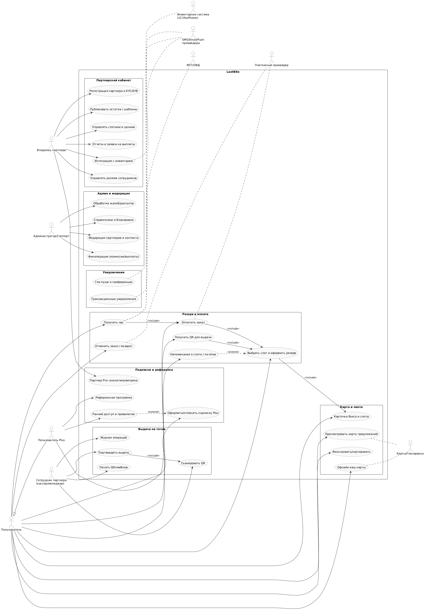
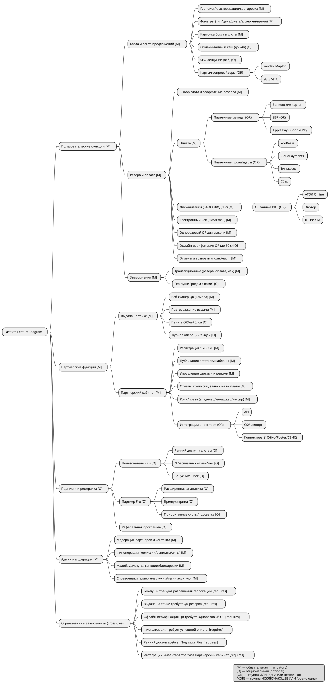

Спецификация требований к программному обеспечению

# Введение

### LastBite — аутлет еды (скидки на готовые блюда и продукты с близким сроком годности, самовывоз)

## Цели
 - Создать мобильный и веб‑сервис для продажи со скидкой готовых блюд и продуктов, подлежащих списаниям из-за истечения срока реализации или годности.  
 - Уменьшить списания у партнеров и дать пользователям экономию и удобство.
 - Обеспечить интеграции с кассами/учетными системами и надежные платежи.
 - Пилотно запуститься в Москве/СПб, масштабировать по кластерами.

## Соглашение о терминах
 - *Бокс/позиция* — набор или единица еды/продукта, выставленные партнером.
 - *Партнер* — юридическое лицо/ИП: кафе, пекарня, супермаркет и т. п.
 - *Слот выдачи* — окно времени, в которое доступен самовывоз.
 - *Резерв* — оформленный и оплаченный заказ на бокс/позицию.
 - *Пользователь Plus/Партнер Pro* — подписные тарифы.
 - *Фискализация* — пробитие чека по 54-ФЗ (ФФД 1.2) через ККТ/ОФД.
 - *SBP* — Система быстрых платежей (динамический QR).
 - *KYC/KYB* — проверки клиента/бизнеса.

## Предполагаемая аудитория и последовательность восприятия

 - Со стороны бизнеса: сети кафе, рестораны, точки питания, сетевые магазины
 - Со стороны пользователей: все люди, которые хотят сэкономить на продуктах питания

## Масштаб проекта

Планируется подписание партнерских контрактов в большинстве населенных пунктов России

 - MVP: iOS/Android приложения, партнерский кабинет (web), базовые интеграции платежей и фискализации, админ‑панель. Геозапуск в ограниченных районах 2 городов.
 - Рост: ML‑рекомендации, подписки, рекламные форматы, расширенные интеграции инвентаря.

---

# Общее описание

## Видение продукта

Сервис, превращающий вечерние списания в выручку партнеров и выгодные покупки пользователям. Простая публикация остатков, карта предложений, быстрый резерв и безопасная выдача по QR.

## Функциональность продукта

 - Пользователь: карта/подборки/фильтры; бронь и оплата в 2–3 тапа; пуш‑уведомления; отзывы;
 - Партнер: публикация боксов/слотов; шаблоны для позиций; кассовые/инвентарные интеграции; поддержка выдачи по QR; отчеты/аналитика.
 - ML/оптимизация: рекомендация слотов/цен; приоритизация показов.
 - Админ: модерация контента/партнеров; финансы; жалобы; справочники.

## Классы и характеристики пользователей

 - Пользователи: студенты, молодые специалисты, семьи, офисные кластеры, “охотники за выгодой”; мобильный first, чувствительны к скорости и надежности; приемлют самовывоз 30–90 мин; неизбирательны.
 - Партнеры: кафе/пекарни/фастфуд/супермаркеты/столовые/отели; низкая толерантность к операционной нагрузке; хотят простые интеграции, прозрачную выручку, контроль слотов и выдачи, своевременную оплату.
 - Менеджеры: удобность в модерации партнеров и их предложений; быстрота решения вопросов и жалоб пользователей.

## Операционная среда

 - Мобильные приложения: iOS 15+ (Swift/SwiftUI), Android 8+ (Kotlin/Jetpack).
 - Партнерский кабинет/админ панель: современный браузер (Chrome/Edge/Firefox/Safari последних 2 версий).
 - Бэкенд: облако РФ (Yandex Cloud/VK Cloud/Selectel), PostgreSQL, Redis, S3‑совместимое хранилище, контейнеризация (Docker/K8s).
 - Карты/гео: Yandex MapKit/2GIS SDK.
 - Платежи: YooKassa/CloudPayments/Тинькофф/Сбер; SBP; Apple Pay/Google Pay через PSP.
 - ККТ/ОФД: АТОЛ/Эвотор/ШТРИХ-М (облако), ОФД соответствующие (Платформа ОФД и др.).
 - Push: FCM/APNs; SMS/OTP: локальные провайдеры (SMSЦентр/Точка/СМСА).

## Рамки, ограничения, правила и станадты

РФ‑комплаенс: локализация ПДн на территории РФ; 54-ФЗ фискализация; договорная схема агента/агрегатора.
 - Безопасность: TLS 1.2+, шифрование ПДн в покое, RBAC, журналирование.
 - Политики качества: контроль сроков годности в описаниях; обязательные инструкции хранения/выдачи.
 - Ограничения: только самовывоз в определенное окно; преимущественно вечерние слоты; общая упаковка “сюрприз‑боксов” с указанием возможных аллергенов.

--- 

# Функциональность системы

## Карта и лента предложений

**Описание и приоритет:** 
Поиск предложений рядом; карточки боксов с детализацией в виде ленты; фильтры (тип продукта, цена, диета, аллерген, время слота), тематические подборки.

**Причинно‑следственные связи, workflows:**
Пользователь открывает приложение → разрешает гео → получает ленту и карту ближайших предложений → применяет фильтры → открывает карточку → просматривает слот/правила выдачи → оформляет резерв.

**Функциональные требования:**
 - Геопоиск в радиусе/по карте; кластеризация пинов; сортировка по расстоянию/времени слота/скидке/рейтингу.
 - Фильтрация предложений.
 - Отображение слотов с доступным количеством товара.
 - Офлайн тайлы и кеш последних данных (в пределах 24 часов) с пометкой “возможна неактуальность”.
 - SEO‑лендинги для веб‑каталога(по возможности).

## Резерв и оплата

**Описание и приоритет:** 
Бронь с предоплатой; выпуск QR; контроль окна самовывоза; штрафы за no‑show; отмены/возвраты.

**Причинно‑следственные связи, workflows:**
Резерв: выбор слота → подтверждение → оплата → чек → QR → пуш напоминаний → скан при выдаче → закрытие.
Отмена: до T‑минут до слота (политика тарифа) → авто‑возврат (полный/частичный).
No‑show: если не выдано до конца окна → списание/штраф → авто‑закрытие.

**Функциональные требования:**
 - Прием платежей: карты, SBP, Apple/Google Pay.
 - Фискализация: по агентской схеме — чек партнерский (или агрегаторский) с признаком способа расчета “передача прав на товар/услугу”, ФФД 1.2; отправка чека по СМС/Email.
 - Генерация одноразового QR (подпись JWT/short‑code), офлайн‑верификация до 60 сек при потере связи.
 - Политики отмен/возвратов по тарифам (Plus — расширенные условия).

## Выдача на точке

**Описание и приоритет:**  
Простой флоу у сотрудника точки.

**Причинно‑следственные связи, workflows:**
Сотрудник открывает партнерский кабинет/сканер → сканирует QR → видит статус резерва и состав → подтверждает выдачу → чек/закрытие.

**Функциональные требования:**
 - Веб‑сканер с камерой; поддержка печати QR для бокс‑лейблов.
 - Роли: кассир/менеджер; журнал операций; повторная выдача недопустима.
 - Защита от подмены времени (серверный контроль окна).

## Партнерский кабинет

**Описание и приоритет:**
Публикация остатков, управление слотами/ценами, интеграции с учетом и кассой, отчеты и выплаты. Must для MVP.

**Причинно‑следственные связи, workflows:**
Создание точки → KYC/KYB → подключение ККТ/платежей → шаблоны боксов → публикация остатков (вручную/через интеграцию) → назначение слотов → отслеживание резервов/выдач → отчеты и заявки на выплаты.

**Функциональные требования:**
 - Профиль партнера, точки, реквизиты, документы; статус проверки.
 - Шаблоны боксов/позиций; массовая публикация; быстрые правки цен/количества.
 - Управление слотами: окно выдачи, лимиты, авто‑закрытие.
 - Отчеты: выручка, комиссии, налоги, статусы выплат; экспорт XLS/CSV.
 - Роли и права (владелец/менеджер/кассир); аудит действий.
 - Интеграции: API/CSV/коннекторы (1С/iiko/Poster/СБИС) — по мере готовности.

## Подписки

**Описание и приоритет:**
Модель лояльности и рост.

**Причинно‑следственные связи, workflows:**
Оформление подписки → начисление привилегий → списание/продление → управление → отмена.

**Функциональные требования:**

 - Пользователь Plus: ранний доступ к слотам, X бесплатных отмен/мес, бонусы/кэшбек.
 - Партнер Pro: расширенная аналитика, бренд‑витрина, приоритетные слоты/подсветка.
 - Реферальные коды/ссылки; антифрод (лимиты на устройство/карту/IP).

## Админ‑панель и модерация
**Описание и приоритет:**
Единое управление экосистемой.

**Причинно‑следственные связи, workflows:**
Обработка заявок партнёров → KYC/KYB → включение/отклонение → мониторинг инцидентов → финоперации → блокировки/разблокировки.

**Функциональные требования:**

Управление пользователями/партнерами/точками/контентом.
Финансы: комиссии, выплаты, корректировки, акты.
Жалобы/диспуты, штрафы, санкции.
Справочники (аллергены, кухни, теги); аудит‑лог; RBAC.

## Уведомления и коммуникации
**Описание и приоритет:**
Транзакционные и маркетинговые уведомления.

**Причинно‑следственные связи, workflows:**
Событие → шаблон → канал (Push/Email/SMS) → доставка → отписки/преференции.

**Функциональные требования:**

 - Пуши/Email/SMS: подтверждения, напоминания о слотах, изменения, промо.
 - Гео‑пуши “рядом с вами” с частотными лимитами и настройками приватности.

---

# Нефункциональные требования

## Требования к производительности
 - API листинга p95 < 300 мс при 1k rps; холодный старт < 800 мс.
 - Отрисовка карты: 500 пинов < 200 мс; клиентская кластеризация.
 - Оформление резерва end‑to‑end p95 < 3 сек.
 - Доставка push p95 < 30 сек.
 - Масштабируемость: MVP 50k MAU / 5k DAU / 1k concurrent; целевое масштабирование до 1M MAU.

## Требования к сохранности данных
 - Бэкапы БД: ежедневные полные + журналы, хранение 35 дней; RPO ≤ 2 часа, RTO ≤ 4 часа.
 - Репликация, мониторинг лагов; миграции с откатами.

## Требования к качеству ПО
 - Доступность: 99.5% для MVP, 99.9% после масштабирования.
 - Тестирование: unit ≥ 70% критичных модулей, e2e ключевых флоу, нагрузочные/хаос‑тесты.
 - Наблюдаемость: централизованные логи, метрики, трассировки, алерты по SLO.

---
# Диаграмма случаев использования

---

# Диаграмма требований

